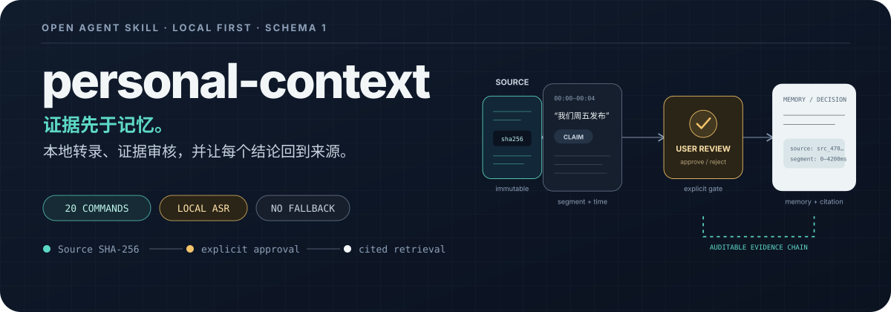
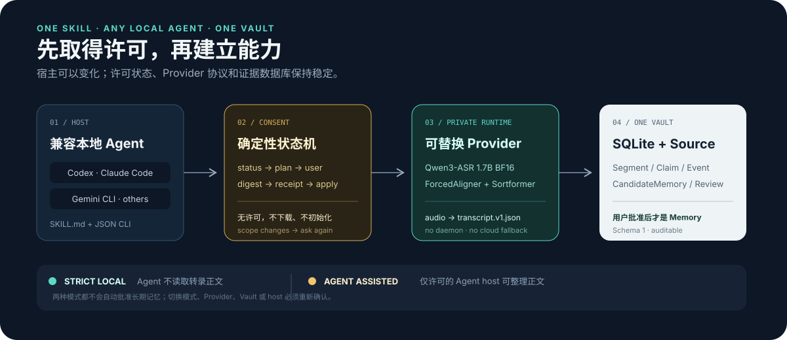
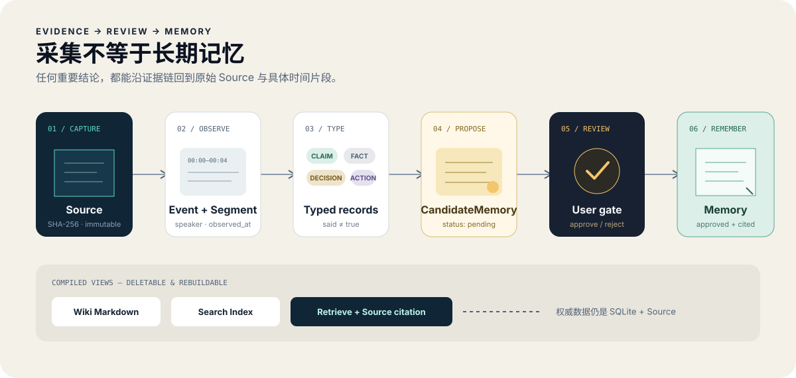

<p align="center">
  
</p>

<p align="center">
  
  
  
  
  
</p>

`personal-context` 是“回响”个人上下文系统的唯一能力入口：一个遵循开放 Agent Skills 格式、能由不同本地 Agent 驱动、可在用户许可后建立本地数据库和本地录音转写环境的开源 Skill。

它最重要的约束不是“记得更多”，而是：**原话不自动成为事实，候选不自动成为记忆，结论必须能回到来源。**

## 它现在能完成什么

- 首次运行时生成机器可读的部署计划，向用户说明路径、下载、许可和隐私边界；
- 用摘要锁定用户明确同意的范围，随后建立唯一 SQLite Vault；
- 在 Apple Silicon 上部署隔离的 Qwen3-ASR BF16 本地转写环境；
- 按 ASR、逐词对齐、人物分析和最终组装分阶段缓存，调整人物算法时不再重跑文字；
- 提供显式、可回退的 3D-Speaker 离线人物实验选项，默认方案保持不变；
- 在已许可的 Agent 辅助模式中，结合声音置信度与句子语义审核人物，本地验证后才发布；
- 把正常录音交付为 Vault `inbox` 中唯一、完整、可读且防误覆盖的 Markdown；
- 在明确请求后，复用逐字稿与关联录音生成可追溯笔记，并单独发布到 `notes`；
- 将录音或文档变成不可变 Source、带时间的 Segment 与默认 Claim；
- 审核 CandidateMemory 后才形成长期 Memory；
- 以来源哈希、观察时间和录音时间范围检索、审计并重新编译 Wiki；
- 通过相同 JSON CLI 被 Codex、Claude Code、Gemini CLI 或其他具备本地执行能力的 Agent 使用。

<p align="center">
  
</p>

## 为什么它不同

| 原则 | 实现 |
|---|---|
| 首次许可不是一句提示词 | `status → plan → notice digest → receipt → apply` 确定性状态机 |
| 本地转录没有静默云端降级 | 本地 Provider 失败就停止；不自动改用 API |
| 模型环境不污染系统 | 私有 Python、虚拟环境、缓存和模型均位于用户配置目录 |
| 转写中断不必从头开始 | 校验和保护的 JSON/gzip 阶段产物按录音和 Vault 隔离，损坏只重算对应分块 |
| 内部 JSON 不污染 inbox | `transcript.v1` 只在私有临时 job 中连接 Provider 与数据库，成功或失败后均清理 |
| 逐字稿与笔记不混放 | `inbox/` 只放逐字稿；显式请求的笔记以同名 Markdown 发布到 `notes/` |
| 原始证据不可静默修改 | Source 按 SHA-256 寻址；Source 与 Segment 受 SQLite 触发器保护 |
| “某人说过”不等于“事实” | 每个语音 Segment 默认形成 `Claim` |
| 采集不等于形成长期记忆 | 只有显式 `approve` 才创建 `Memory` |
| 模型可替换，数据库不分裂 | Provider 统一输出 `transcript.v1.json`，再进入同一个 Schema 1 |
| Agent 可换，协议不变 | 标准 `SKILL.md`、显式路径、JSON stdout/stderr 和稳定退出码 |

## 兼容性

“跨 Agent”与“跨硬件”是两件事：

| 环境 | 数据库与转录导入 | 自动本地录音转写 |
|---|---:|---:|
| Codex / Claude Code / Gemini CLI，且可运行本地命令 | 完整 | 取决于电脑 |
| macOS Apple Silicon | 完整 | 默认 `qwen-mlx`；可单独许可实验 `qwen-mlx-3dspeaker` |
| Linux / Windows / 普通 CPU | 完整 | 本版使用 `transcript-only` |
| 纯网页 Agent、无本地文件或进程权限 | 无法自动部署 | 无法自动部署 |

`auto` 只会在 macOS Apple Silicon 选择 `qwen-mlx`，其他环境选择 `transcript-only`，永远不会自动选择云服务或实验人物方案。

## 安装 Skill

克隆仓库后，把 `personal-context/` 复制到宿主的 Skill 目录：

```bash
git clone https://github.com/Martainals/personal-context.git
cd personal-context

# Codex
rsync -a personal-context/ "${CODEX_HOME:-$HOME/.codex}/skills/personal-context/"

# Claude Code
rsync -a personal-context/ "$HOME/.claude/skills/personal-context/"

# Gemini CLI
rsync -a personal-context/ "$HOME/.gemini/skills/personal-context/"
```

也可不安装，直接从源码调用：

```bash
./personal-context/scripts/context version
```

Windows 或没有 POSIX shell 的宿主使用：

```text
py personal-context/scripts/personal_context.py version
```

## 第一次使用

先选择一个新的或现有 Vault 路径，只读检查当前状态：

```bash
CONTEXT_ROOT="/path/to/personal-context-vault"

./personal-context/scripts/context bootstrap-status \
  --root "$CONTEXT_ROOT" \
  --agent-host codex
```

然后生成完整计划。`strict-local` 不允许 Agent 读取转录正文；`agent-assisted` 允许当前命名的 Agent 按其宿主数据政策整理正文：

```bash
./personal-context/scripts/context bootstrap-plan \
  --root "$CONTEXT_ROOT" \
  --agent-host codex \
  --mode strict-local
```

默认 `auto` 使用稳定 Provider。要在首次初始化时选择实验离线人物方案，请在状态、计划、许可和应用命令中都显式加上：

```bash
--provider qwen-mlx-3dspeaker
```

只有用户明确接受计划后，Agent 才能把返回的摘要写入许可记录：

```bash
./personal-context/scripts/context record-consent \
  --root "$CONTEXT_ROOT" \
  --agent-host codex \
  --mode strict-local \
  --provider auto \
  --accept-plan '<bootstrap-plan 返回的 plan_digest>'

./personal-context/scripts/context bootstrap-apply \
  --root "$CONTEXT_ROOT" \
  --agent-host codex \
  --provider auto
```

在 Apple Silicon 上，首次 `bootstrap-apply` 会在私有目录安装约 6.5 GB 模型与隔离运行环境，至少预留 10 GB 空间。许可计划也会明确说明默认启用的持久转写阶段缓存；只有接受 Notice 2 后才会生效。流程可恢复执行，不修改系统 Python，不启动后台服务。

实验 `qwen-mlx-3dspeaker` 必须从计划到应用始终显式指定同一 Provider。全新机器的计划会安装 Qwen ASR/逐词对齐（不会额外下载用不到的 Sortformer），再安装独立 3D-Speaker/Torch 环境：合计预计约 7.5 GB 下载，并保守要求约 14 GB 可用空间。已经安装当前 Qwen 环境的机器只会列出额外约 1.5 GB 下载和至少 4 GB 可用空间。计划包含固定的 Python 包、3D-Speaker 源码提交、`git` 系统要求和两个 ModelScope 模型；未接受该计划时不会安装。

开源仓库只保存初始化脚本和精确锁文件，不保存虚拟环境、源码检出、模型、许可或转写缓存。所有大型文件都由 `bootstrap-apply` 安装到操作系统的用户私有配置目录。安装中断后先查看 `bootstrap-status` 返回的缺失组件，再重新运行 `bootstrap-apply`；已经完整的环境不会重复安装，任一组件仍不完整时也不会误报 `ready`。

## 明确要求转写一段录音之后

附件出现本身不会触发采集或转写。只有用户明确要求“转写”或“生成逐字稿”后，Agent 才应调用高层交付命令：

Agent 应将录音落为一个明确的本地文件路径，再使用高层交付命令：

```bash
./personal-context/scripts/context capture-audio \
  --root "$CONTEXT_ROOT" \
  --agent-host codex \
  --audio /path/to/recording.m4a \
  --language Chinese \
  --check-only
```

只读预检已有交付时直接返回，否则报告需要内容标题。在 `agent-assisted` 模式下，Agent 把低层转写和 `--speaker-review-output` 写进 Vault 与 Skill 之外的私有临时目录：一方面依据正文生成 8–20 个中文字的具体标题，另一方面把录音内容视为数据，按重叠窗口结合声音置信度和句子完整性生成人物调整决定。最后执行 `capture-audio --title <内容标题> --speaker-review-decisions <decisions.json>`。本地验证器不允许 Agent 修改文字、时间、顺序、片段数或增加人物；第二次调用复用阶段缓存，不重复运行重模型。成功或失败后都清理三份临时 JSON。`strict-local` 模式不允许 Agent 读取正文或运行语义人物审核，应使用用户标题或 `未命名主题`。

正式命令会依次预检原音频、在私有 job 中生成并验证 `transcript.v1`、采集原音频 Source、原子导入证据，最后才把 `YYYY-MM-DD HH：MM：SS-内容标题.md` 原子发布到 `inbox/`。录音文件名中的时间优先；同一时间和标题冲突时自动追加 `-2`。成功后 job JSON 删除；Provider、渲染或导入失败时，inbox 不出现 JSON 或半成品。标准输出只含 ID、计数、Markdown 元数据及 Provider/cache 元数据，不打印正文。

Markdown 包含标题、完整状态、总时长、人物标签与按 `HH:MM:SS` 排序的全部逐字稿。不可见完整性标记允许安全重跑；如果用户编辑过文件，系统拒绝覆盖并保留原件。

同一路径已有完整、未编辑且数据库证据匹配的逐字稿时，默认直接返回现有 Markdown，不调用模型。只有明确要求重新转写时才使用 `--rerun`；标题、观察时间或人物/文字 Segment 变化会被 Schema 1 拒绝，以免静默建立第二个 Event 或覆盖不可变证据。接受修订后的逐字稿仍需要未来独立设计版本化流程。正常流程不会扫描其他目录或文件名寻找改名副本。

Vault 会在 `blobs/` 中保留一份不可变原音频；系统不会删除或移动用户提供位置的原件。

## 明确要求生成录音笔记之后

单独要求转写时不会自动产生笔记。只有用户明确要求“总结”“归纳”“生成笔记”或同时要求“转写并整理成笔记”时，Agent 才进入笔记流程。已有完整逐字稿会直接复用，不重新运行 ASR、逐词对齐、人物识别或组装。

先进行只读预检：

```bash
./personal-context/scripts/context publish-note \
  --root "$CONTEXT_ROOT" \
  --transcript "$CONTEXT_ROOT/inbox/2026-01-02 03：04：05-内容标题.md" \
  --check-only
```

在已许可的 `agent-assisted` 模式中，Agent 根据返回的确切逐字稿和关联原录音，在 Vault 之外生成一份私有 Markdown 草稿，再交给本地程序校验发布：

```bash
./personal-context/scripts/context publish-note \
  --root "$CONTEXT_ROOT" \
  --transcript "$CONTEXT_ROOT/inbox/2026-01-02 03：04：05-内容标题.md" \
  --draft /private/path/note-draft.md
```

最终结果只出现在 `notes/`，并与逐字稿使用完全相同的文件名。完整性标记把笔记同时绑定到原录音和确切逐字稿版本；重复执行默认返回现有笔记，只有用户明确要求重新生成时才使用 `--rerun`。人工修改后的笔记不会被静默覆盖。笔记是派生阅读视图，不自动生成 CandidateMemory 或长期 Memory；在 `strict-local` 模式中，Agent 不读取逐字稿生成总结。

人数默认自动判断，不需要询问用户；只有用户主动明确人数时才传 `--speaker-count 1..4`。已录完的文件默认使用高上下文 Sortformer 配置，再依据整段录音的置信度统一说话人通道、清除短暂跳变并组装发言轮次。

对长录音人物错分做诊断时，可以先生成 `--provider qwen-mlx-3dspeaker` 的许可计划。该实验方案复用原有 Qwen 文字与逐词时间戳，在独立 Torch 环境中整段聚类人物；人物模型或运行环境变化只让人物阶段与最终组装失效，不会重新计算 ASR 或对齐。它不会被 `auto` 选中，也不能在没有新计划和许可的情况下静默替换默认值。

ASR 已识别出的标点会在逐词对齐后安全贴回；只有正文字符相似度达到 0.95 才执行，绝不补猜原词。最终逐字稿按句末标点或至少 0.8 秒停顿断段，改善长段无标点、难阅读和不利于后续归纳的问题。

重复处理同一录音时默认复用私有阶段产物，并用稳定 ID 避免重复 Source、Event 和 Segment。标题、观察时间、人数提示和说话人后处理调整不会让 ASR 或逐词对齐失效；人数与后处理会从已缓存的原始说话人概率重新派生。

`transcribe-audio --output <json>` 保留为调试和第三方集成的低层接口，不是正常 Skill 交付路径。需要诊断时可以绕过缓存或只刷新一个阶段：

```bash
# 完全绕过本次缓存读写
./personal-context/scripts/context transcribe-audio \
  --root "$CONTEXT_ROOT" --agent-host codex \
  --audio /path/to/recording.m4a --output /private/path/fresh.json \
  --no-cache

# 仅刷新逐词对齐；也可选择 asr、diarization 或 all
./personal-context/scripts/context transcribe-audio \
  --root "$CONTEXT_ROOT" --agent-host codex \
  --audio /path/to/recording.m4a --output /private/path/refreshed.json \
  --refresh-stage alignment
```

> 本地模型不上传音频，但如果用户先把附件上传到云端聊天页面，该宿主可能已经收到文件。敏感录音应尽量以本地路径交给具备本地访问能力的 Agent。

## 本地模型配置

默认模型全部锁定在 [`qwen-mlx.lock.json`](./personal-context/assets/providers/qwen-mlx.lock.json)：

| 环节 | 模型 | 作用 |
|---|---|---|
| 转写 | Qwen3-ASR-1.7B-bf16 | 中文与多语言高精度识别 |
| 对齐 | Qwen3-ForcedAligner-0.6B-bf16 | 字/词级时间戳 |
| 多人分离 | Streaming Sortformer v2.1 fp32 | 高上下文推理、全局人数约束与最多四个录音内标签 |

说话人标签只在单次录音中使用 `S01`–`S04`，不是声纹身份。五人以上、强噪声、重叠发言、超长录音或非英语多人会议可能降低分离质量。

实验人物方案另由 [`3dspeaker-offline.lock.json`](./personal-context/assets/providers/3dspeaker-offline.lock.json) 锁定 3D-Speaker 源码、CAM++、VAD 与 Torch 依赖。人声向量和聚类中心只存在于隔离子进程内存；缓存只保存匿名人物时间轴和两个标量分数。当前关闭重叠说话扩展，也不建立“我的声音”或跨录音身份。

## 证据与记忆

<p align="center">
  
</p>

常规审核与检索：

```bash
./personal-context/scripts/context candidates --root "$CONTEXT_ROOT" --status pending
./personal-context/scripts/context review --root "$CONTEXT_ROOT" '<event-id>'
./personal-context/scripts/context approve \
  --root "$CONTEXT_ROOT" '<candidate-id>' \
  --reviewer user --reason "已核对来源和有效时间"

./personal-context/scripts/context compile-wiki --root "$CONTEXT_ROOT" --dry-run
./personal-context/scripts/context compile-wiki --root "$CONTEXT_ROOT"
./personal-context/scripts/context retrieve --root "$CONTEXT_ROOT" "周五发布"
```

检索严格区分：

- `authority=approved_memory`：经过明确审核的长期记忆；
- `authority=source_evidence`：来源证据，不自动等同于事实。

## Vault 与私有运行环境

Vault 由用户选择，是唯一权威数据层：

```text
<vault>/
├── context.sqlite3
├── blobs/          # 不可变 Source
├── inbox/          # 正常录音交付：每段录音一个完整 Markdown
├── notes/          # 明确请求后生成：与逐字稿同名的笔记 Markdown
├── wiki/           # 可重建阅读视图
└── backups/
```

许可、私有 Python、模型和缓存位于操作系统用户配置目录，也可以用 `--config-dir` 显式指定。macOS 默认阶段产物路径是 `~/Library/Application Support/personal-context/artifacts/<vault-scope-hash>/<audio-sha256>/`；它们不进入 Vault、Git 仓库或数据库导出。

缓存不会后台清理。状态检查只返回路径、大小、阶段和校验结果，不返回转录正文；清理默认仅预览，必须显式 `--apply`：

```bash
./personal-context/scripts/context transcription-cache-status --root "$CONTEXT_ROOT"
./personal-context/scripts/context transcription-cache-status --root "$CONTEXT_ROOT" --limit 10
./personal-context/scripts/context transcription-cache-status --root "$CONTEXT_ROOT" --source-id '<source-id>'
./personal-context/scripts/context transcription-cache-prune --root "$CONTEXT_ROOT" --dry-run
./personal-context/scripts/context transcription-cache-prune --root "$CONTEXT_ROOT" --apply
./personal-context/scripts/context storage-status --root "$CONTEXT_ROOT"
```

缓存状态会显示录音名、Source ID、阶段数量、大小、最近写入时间和完整性；没有 Source 的残留缓存会标记为 `unbound`，但不会返回正文。缓存命令可加 `--audio /path/to/recording.m4a` 或 `--source-id <id>` 选择一条录音。`storage-status` 汇总原音频、数据库、Inbox、Notes、缓存、运行环境和已知临时残留的元数据。产物使用 JSON/gzip 与 SHA-256 校验，不使用 pickle，不保存声纹、说话人 embedding 或聚类中心。

## 版本与维护

| 项目 | 当前值 |
|---|---|
| Skill | `0.9.0` |
| SQLite Schema | `1` |
| Consent notice | `2` |
| Provider contract | `1` |
| Artifact contract | `1` |
| Note Markdown contract | `1` |
| qwen-mlx profile | `4` |
| qwen-mlx-3dspeaker profile | `1`（实验） |

0.9.0 增加显式触发的录音笔记交付层：Agent 在许可范围内结合完整逐字稿和关联录音生成私有草稿，本地程序校验来源、标题和完整性后，只向 `notes/` 发布与逐字稿同名的 Markdown。单独转写仍只生成 `inbox` 逐字稿；重复执行不堆积文件，人工修改不被覆盖，也不会自动形成长期记忆。没有数据库迁移、模型下载、模型重装或许可更新。

项目根目录的 [`AGENTS.md`](./AGENTS.md) 是后续 Agent 开发和升级的唯一维护章程。`CLAUDE.md`、`GEMINI.md` 只引用它，避免多份规则漂移；Codex 的 `personal-context/agents/openai.yaml` 仅是可选界面元数据。

## 开发与验证

数据库与初始化控制层只依赖 Python 3.9+ 标准库和 SQLite。模型推理依赖只安装进私有运行环境。

```bash
PYTHONPYCACHEPREFIX=/tmp/personal-context-pycache \
  python3 -m unittest discover -s tests -v
```

自动测试使用临时路径、中文合成数据和模拟 Provider；不会下载模型，也不会接触真实个人 Vault。

## 项目结构

```text
.
├── AGENTS.md                     # 唯一项目维护章程
├── CLAUDE.md / GEMINI.md         # 指向 AGENTS.md 的宿主薄入口
├── personal-context/
│   ├── SKILL.md
│   ├── VERSION
│   ├── agents/openai.yaml        # 可选 Codex UI 元数据
│   ├── scripts/
│   │   ├── context
│   │   ├── personal_context.py
│   │   ├── personal_context_bootstrap.py
│   │   ├── transcript_markdown.py
│   │   ├── note_markdown.py
│   │   └── providers/
│   │       ├── qwen_mlx.py
│   │       ├── diarization_3dspeaker.py
│   │       ├── artifacts.py
│   │       └── transcript_assembly.py
│   ├── assets/providers/         # 锁定包、模型和限制
│   ├── assets/templates/
│   └── references/
├── assets/readme/
└── tests/
```

## 明确不做

- 未经审核自动形成长期记忆；
- 声纹身份识别或跨录音追踪说话人；
- 后台监听、持续采集或常驻转录服务；
- 静默上传、静默云端回退或自动配置 API Key；
- 自动人格建模；
- 把 Wiki 或搜索索引当成唯一权威来源。

## License

[MIT](./LICENSE) © 2026 Martainals

模型权重遵循各自锁定文件中标明的上游许可；安装前应阅读对应模型卡。
